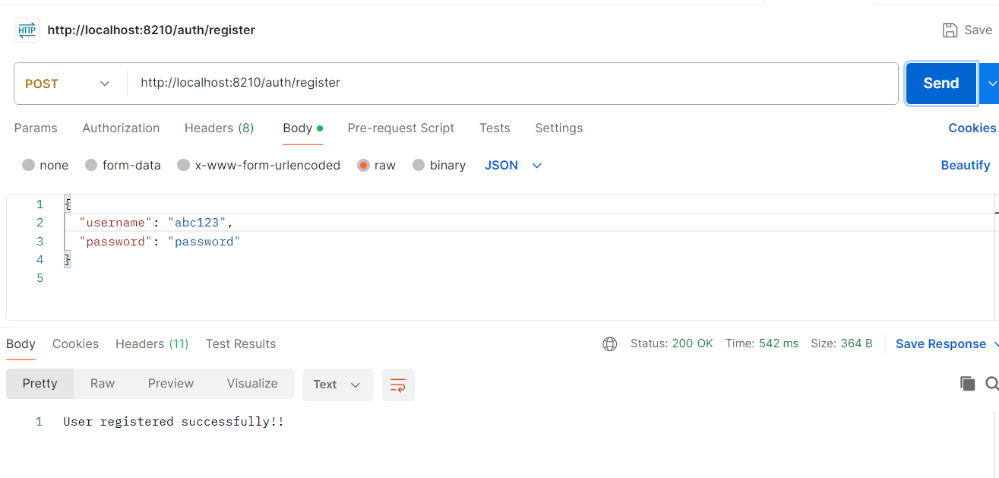

# to-do-list-with-auth

use to do list
-------------
1. Register your self give username and password
2. login using username and password, will generate token
3. use the token to create to do list, get to do list, update to do list and delete to do list

